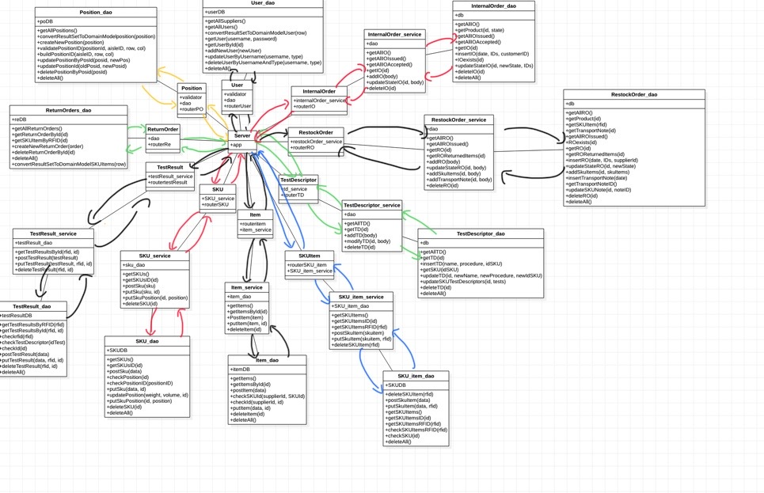

# Integration and API Test Report

Date:

Version:

# Contents

- [Dependency graph](#dependency graph)

- [Integration and API Test Report](#integration-and-api-test-report)
- [Contents](#contents)
- [Dependency graph](#dependency-graph)
- [Integration approach](#integration-approach)
- [Integration Tests](#integration-tests)
  - [Step 1](#step-1)
  - [Step 2](#step-2)
  - [Step 3](#step-3)
- [API testing - Scenarios](#api-testing---scenarios)
  - [Scenario UCx.y](#scenario-ucxy)
- [Coverage of Scenarios and FR](#coverage-of-scenarios-and-fr)
- [Coverage of Non Functional Requirements](#coverage-of-non-functional-requirements)

- [Tests](#tests)

- [Scenarios](#scenarios)

- [Coverage of scenarios and FR](#scenario-coverage)
- [Coverage of non-functional requirements](#nfr-coverage)

# Dependency graph 

     
# Integration approach
We used a bottom up integration approach since we had already completed unit tests, supposing we've already fixed the majority of failures on them. That means we started from test individual units (dao), then proceeded with services testing  methods integration until the top (API).

Step1: Unit Testing (see UnitTestReport.md) dao

Step2: dao + service

Step3: EzWH (API testing)

#  Integration Tests

   <define below a table for each integration step. For each integration step report the group of classes under test, and the names of
     Jest test cases applied to them, and the mock ups used, if any> Jest test cases should be here code/server/unit_test

## Step 1
| Classes  | mock up used |Jest test cases |
|--|--|--|
| InternalOrder_service | InternalOrder_mockdao | InternalOrder_service_mockdao.test |
| RestockOrder_service | RestockOrder_mockdao | RestockOrder_service_mockdao.test |
| RestockOrder_dao | | RestockOrder_dao.test |
| TestDescriptor_service | TestDescriptor_mockdao | TestDescriptor_service_mockdao.test |

## Step 2
| Classes | Jest test cases |
| -- | -- |
| RestockOrder_service_mockdao + RestockOrder_dao.test | |

## Step 3
   
| Classes |Jest test cases |
|--|--|
| Restock Order | POST restock order |
| | GET restock order |
| | PUT restock order |
| | DELETE restock order |
| Internal Order | POST internal order |
| | GET internal order |
| | PUT internal order |
| | DELETE internal order |
| Test Descriptor | POST test descriptor |
| | GET test descriptor |
| | PUT test descriptor |
| | DELETE test descriptor |

# API testing - Scenarios

<If needed, define here additional scenarios for the application. Scenarios should be named
 referring the UC in the OfficialRequirements that they detail>

## Scenario UCx.y

| Scenario |  name |
| ------------- |:-------------:| 
|  Precondition     |  |
|  Post condition     |   |
| Step#        | Description  |
|  1     |  ... |  
|  2     |  ... |

# Coverage of Scenarios and FR

<Report in the following table the coverage of  scenarios (from official requirements and from above) vs FR. 
Report also for each of the scenarios the (one or more) API Mocha tests that cover it. >  Mocha test cases should be here code/server/test

| Scenario ID | Functional Requirements covered | Mocha  Test(s) | 
| ----------- | ------------------------------- | ----------- | 
| 1-1         | FR2.1, FR2.3                    |             |             
| 1-2         | FR2.1, FR2.4                    |             |             
| 1-3         | FR2.1, FR2.4                    |             |
| 2-1         | FR2.1.1                         |             |
| 2-2         | FR3.1.1                         |             |
| 2-3         | FR3.1.4, FR3.1.3                |             |
| 2-4         | FR3.1.4                         |             |
| 2-5         | FR3.1.2                         |             |
| 3-2         | FR5.1                           | "post RO"     |
| 4-1         |  -                              |             |
| 4-2         | FR1.5, FR1.3, FR1.4             |             |
| 4-3         | FR1.2                           |             |
| 5-1-1       | FR5.7                           | "modify RO state"            |
| 5-2-1       | FR3.2.1                         |             |
| 5-2-2       | FR3.2.1                         |             |
| 5-2-3       | FR3.2.1                         |             |
| 5-3-1       | FR3.2.                          |             |
| 5-3-2       | FR3.2                           |             |
| 5-3-3       | FR3.2                           |             |
| 6-1         | FR3.2                           |             |
| 6-2         | FR3.2                           |             |
| 7-1         | -                               |             |
| 7-2         | -                               |             |
| 9-1         | FR6.6                           | "post IO"            |
| 9-2         | FR6.6                           |  "modify IO"           |
| 9-3         | FR6.7                           |  "modify IO"           |
| 10-1        | FR6.7, FR6.8                    |  "modify IO"           |
| 11-1        | FR7                             |            |
| 11-2        | FR7                             |            |
| 12-1        | FR3.2.1                         |  "post TD"          |
| 12-2        | FR3.2.2                         |  "modify TD"           |
| 12-3        | FR3.2.3                         |  "delete TD by id"      |            

# Coverage of Non Functional Requirements
 
| Non Functional Requirement | Test name |
| -------------------------- | --------- |
| NFR4 - Position ID is the unique identifier of a position, 12 digits, and is derived from aisle (4digits) row (4 digits) col (4 digits), 4 first digits for aisle, middle 4 for row, last 4 for col        |  positionTest  |
|NFR5 - SKU.id is a string of 12 digits| SKUIDStringLenghtTest|
|NFR6 - RFID is a string of 32 digits|  RFIDStringLenghtTest  |
|NFR9 - Date Format is YYYY/MM/GG HH:MM| DatevalidationTest with dayjs|

