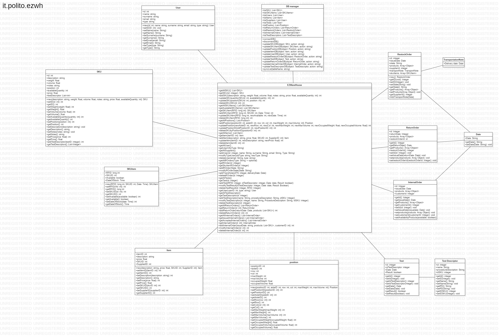
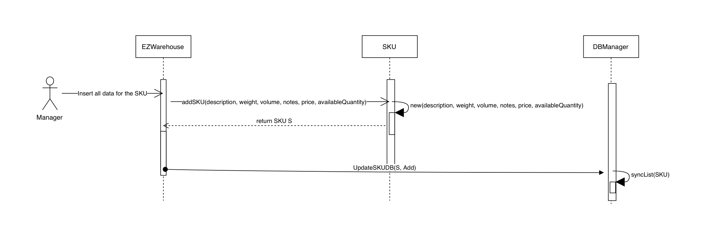
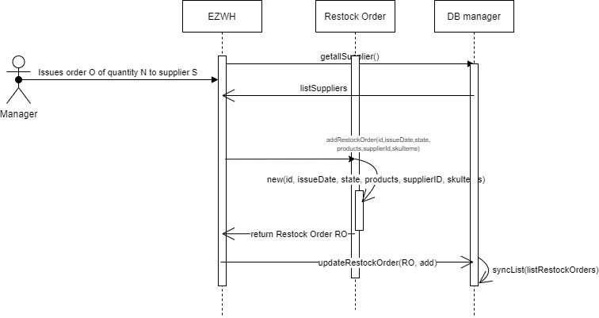
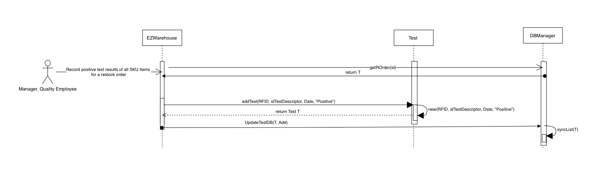
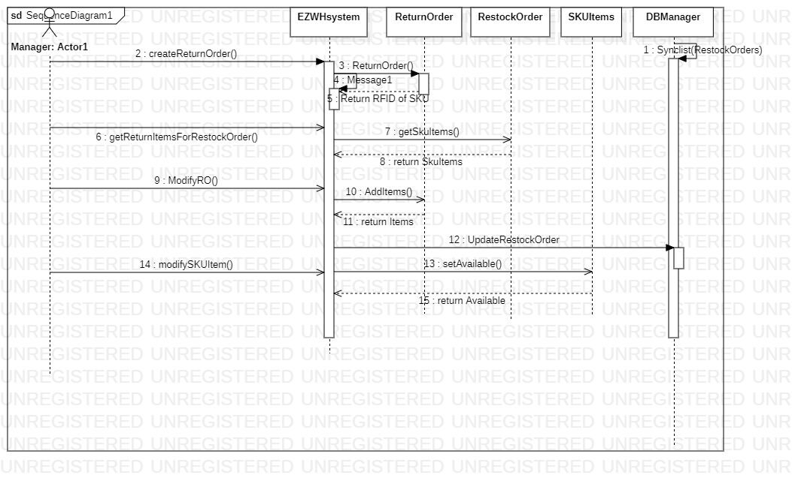
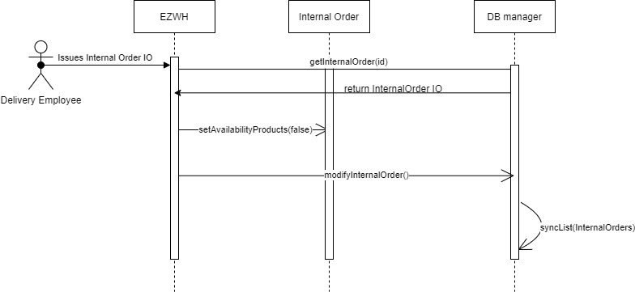

# Design Document 

Authors: 

Date:

Version:

# Contents

- [Design Document](#design-document)
- [Contents](#contents)
- [Instructions](#instructions)
- [High level design](#high-level-design)
- [Low level design](#low-level-design)
- [Verification traceability matrix](#verification-traceability-matrix)
- [Verification sequence diagrams](#verification-sequence-diagrams)
  - [Sequence diagram of Scenario 1-1](#sequence-diagram-of-scenario-1-1)
  - [Sequence diagram of Scenario 3-2](#sequence-diagram-of-scenario-3-2)
  - [Sequence diagram of scenario 4-1](#sequence-diagram-of-scenario-4-1)
  - [Sequence diagram of scenario 5-2-1](#sequence-diagram-of-scenario-5-2-1)
  - [Sequence diagram of scenario 6-1](#sequence-diagram-of-scenario-6-1)
  - [Sequence diagram of scenario 6-1](#sequence-diagram-of-scenario-6-1-1)
  - [Sequence diagram of scenario 11-1](#sequence-diagram-of-scenario-11-1)

# Instructions

The design must satisfy the Official Requirements document, notably functional and non functional requirements, and be consistent with the APIs

# High level design 
The application will follow the client-server model because the application is accessed via multiple devices at once and the data must remain synchronized.

# Low level design

# Verification traceability matrix

| FR | EzWarehouse | SKU | SKUItem | User | Internal Order | Restock Order | Return Order | Position | Item | Test | Test Descriptor | DBManager |
| :---: | :---: | :---: | :---: | :---: | :---: | :---: | :---: | :---: | :---: | :---: | :---: | :---: |
| 1 | x | | | x | | | | | |  |  | x |
| 2 | x | x | | | | | | | |  |  | x |
| 3 | x | | |  | | | | x | | x | x | x |
| 4 | x | | | x | |  | | | |  |  | x |
| 5 | x | x | x |  | | x | x | | | x | x | x |
| 6 | x | x | x | | x |  | | | |  |  | x |
| 7 | x | | | | | | | | x |  |  | x |

# Verification sequence diagrams 

## Sequence diagram of Scenario 1-1

## Sequence diagram of Scenario 3-2

## Sequence diagram of scenario 4-1

## Sequence diagram of scenario 5-2-1

## Sequence diagram of scenario 6-1

## Sequence diagram of scenario 6-1

## Sequence diagram of scenario 11-1
