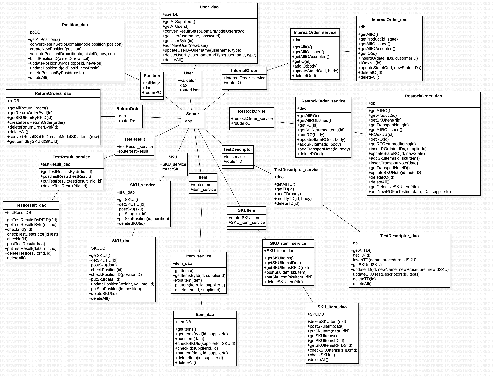

# Design Document 

Authors: 

Date: 25/05/2022

Version: v2.0

# Contents

- [Design Document](#design-document)
- [Contents](#contents)
- [Instructions](#instructions)
- [High level design](#high-level-design)
- [Low level design](#low-level-design)
- [Verification traceability matrix](#verification-traceability-matrix)
- [Verification sequence diagrams](#verification-sequence-diagrams)
  - [Sequence diagram of Scenario 3-1](#sequence-diagram-of-scenario-3-1)
  - [Sequence diagram of scenario 4-1](#sequence-diagram-of-scenario-4-1)
  - [Sequence diagram of scenario 11-1](#sequence-diagram-of-scenario-11-1)

# Instructions

The design must satisfy the Official Requirements document, notably functional and non functional requirements, and be consistent with the APIs

# High level design 
The application will follow the client-server model because the application is accessed via multiple devices at once and the data must remain synchronized.

# Low level design

# Verification traceability matrix
| FR | Server | SKU | SKU_service | SKU_dao | Item | Item_service | Item_dao | SKUItem | SKUItem_service | SKUItem_dao | TestDescriptor | TestDescriptor_service | TestDescriptor_dao | RestockOrder | RestockOrder_service | RestockOrder_dao | InternalOrder | InternalOrder_service | InternalOrder_dao | User | User_dao | Position | Position_dao | ReturnOrder | ReturnOrder_dao | TestResult | TestResult_service | TestResult_dao |
| :---: | :---: | :---: | :---: | :---: | :---: | :---: | :---: | :---: | :---: | :---: | :---: | :---: | :---: | :---: | :---: | :---: | :---: | :---: | :---: | :---: | :---: | :---: | :---: | :---: | :---: | :---: | :---: | :---: |
| 1 | x |  |  |  |  |  |  |  |  |  |  |  |  |  |  |  |  |  |  | x | x |  |  |  |  |  |  |  |
| 2 | x | x | x | x |  |  |  |  |  |  | x | x | x |  |  |  |  |  |  |  |  | x | x |  |  | x | x | x |
| 3 | x |  |  |  |  |  |  |  |  |  |  |  |  |  |  |  |  |  |  | x | x |  |  |  |  |  |  |  | 
| 4 | x |  |  |  |  |  |  |  |  |  |  |  |  |  |  |  |  |  |  |  |  |  |  |  |  |  |  |  | 
| 5 | x | x | x | x |  |  |  | x | x | x | x | x | x | x | x | x |  |  |  |  |  |  |  | x | x | x | x | x | 
| 6 | x |  |  |  |  |  |  | x | x | x |  |  |  |  |  |  | x | x | x |  |  |  |  |  |  |  |  |  | 
| 7 | x |  |  |  | x | x | x |  |  |  |  |  |  |  |  |  |  |  |  |  |  |  |  |  |  |  |  |  |

# Verification sequence diagrams 

## Sequence diagram of Scenario 3-1

## Sequence diagram of scenario 4-1

## Sequence diagram of scenario 11-1
