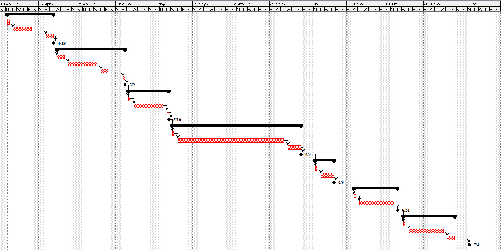

# Project Estimation  
Date: 10/04/2022

Version: 1.0

# Estimation approach
Consider the EZWH  project as described in YOUR requirement document, assume that you are going to develop the project INDEPENDENT of the deadlines of the course
# Estimate by size
### 
|             | Estimate                        |             
| ----------- | :-------------------------------: |  
| NC =  Estimated number of classes to be developed   |    12 |                    
|  A = Estimated average size per class, in LOC       |         150                   | 
| S = Estimated size of project, in LOC (= NC * A) | 1800 |  
| E = Estimated effort, in person hours (here use productivity 10 LOC per person hour) | 180 |   
| C = Estimated cost, in euro (here use 1 person hour cost = 30 euro) | 5400 | 
| Estimated calendar time, in calendar weeks (Assume team of 4 people, 8 hours per day, 5 days per week ) |          1.1          |               

# Estimate by product decomposition
### 
|         component name    | Estimated effort (person hours)   |             
| ----------- | :-------------------------------: | 
|requirement document    | 160 |
| GUI prototype | 60 |
|design document | 50 |
|code |300|
| unit tests |90|
| api tests |70|
| management documents  |250|

# Estimate by activity decomposition
### 
|         Activity name    | Estimated effort (person hours)   |             
| ----------- | :-------------------------------: | 
| 1)Requirement document | 56 |
| 1.1) Planning | 8 |
| 1.2) Development | 32 |
| 1.3) Check consistency | 16 |
| 2)GUI prototype | 72 |
| 2.1) Planning | 16 |
| 2.2) Development | 32 |
| 2.3) Check consistency | 16 |
| 2.4) Testing | 8 |
| 3)Design document | 48 |
| 3.1) Planning | 8 |
| 3.2) Development | 32 |
| 3.3) Check consistency | 8 |
| 4)Coding | 144 |
| 4.1) Planning | 16 |
| 4.2) Development | 112 |
| 4.4) Testing | 24 |
| 5)Unit test | 32 |
| 5.1) Planning | 8 |
| 5.2) Development | 24 |
| 6)APIs test | 48 |
| 6.1) Planning | 8 |
| 6.2) Development | 40 |
| 7)Management document | 64 |
| 7.1) Planning | 8 |
| 7.2) Development | 40 |
| 7.3) Check consistency | 16 |

###
Insert here Gantt chart with above activities:

# Summary

Report here the results of the three estimation approaches. The  estimates may differ. Discuss here the possible reasons for the difference

|             | Estimated effort                        |   Estimated duration |          
| ----------- | :-------------------------------: | :---------------:|
| estimate by size | 180 | 1.1 weeks |
| estimate by product decomposition |980| 6.1 weeks |
| estimate by activity decomposition |464| 2.9 weeks |
