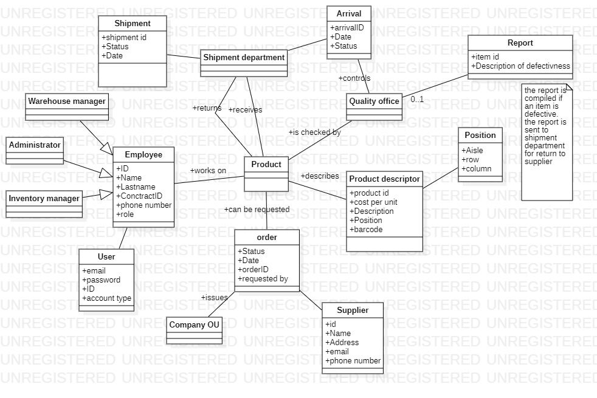

#Requirements Document 

Date: 22 march 2022

Version: 0.0

 
| Version number | Change |
| ----------------- |:-----------|
| | | 

# Contents

- [Informal description](#informal-description)
- [Stakeholders](#stakeholders)
- [Context Diagram and interfaces](#context-diagram-and-interfaces)
	+ [Context Diagram](#context-diagram)
	+ [Interfaces](#interfaces) 
	
- [Contents](#contents)
- [Informal description](#informal-description)
- [Stakeholders](#stakeholders)
- [Context Diagram and interfaces](#context-diagram-and-interfaces)
	- [Context Diagram](#context-diagram)
	- [Interfaces](#interfaces)
- [Stories and personas](#stories-and-personas)
- [Functional and non functional requirements](#functional-and-non-functional-requirements)
	- [Functional Requirements](#functional-requirements)
	- [Non Functional Requirements](#non-functional-requirements)
- [Use case diagram and use cases](#use-case-diagram-and-use-cases)
	- [Use case diagram](#use-case-diagram)
		- [Use case 1, UC1 - Registration on the EzWh application](#use-case-1-uc1---registration-on-the-ezwh-application)
				- [Scenario 1.1](#scenario-11)
				- [Scenario 1.2](#scenario-12)
				- [Scenario 1.3](#scenario-13)
				- [Scenario 1.4](#scenario-14)
		- [Use case 2, UC2 - Login on the EzWh application](#use-case-2-uc2---login-on-the-ezwh-application)
				- [Scenario 2.1](#scenario-21)
				- [Scenario 2.2](#scenario-22)
				- [Scenario 2.3](#scenario-23)
		- [Use case 3, UC3 - Make an order for a supplier](#use-case-3-uc3---make-an-order-for-a-supplier)
				- [Scenario 3.1](#scenario-31)
				- [Scenario 3.2](#scenario-32)
				- [Scenario 3.3](#scenario-33)
		- [Use case 4, UC4 - Quality check on product already in database](#use-case-4-uc4---quality-check-on-product-already-in-database)
				- [Scenario 4.1](#scenario-41)
				- [Scenario 4.2](#scenario-42)
		- [Use case 5, UC5 - Quality check on new product](#use-case-5-uc5---quality-check-on-new-product)
				- [Scenario 5.1](#scenario-51)
				- [Scenario 5.2](#scenario-52)
		- [Use case 6, UC6 - Return shipment of defective product](#use-case-6-uc6---return-shipment-of-defective-product)
				- [Scenario 6.1](#scenario-61)
				- [Scenario 6.2](#scenario-62)
		- [Use case 7, UC7 - Manage products](#use-case-7-uc7---manage-products)
				- [Scenario 7.1](#scenario-71)
				- [Scenario 7.2](#scenario-72)
		- [Use case 8, UC8 - Manage users and rights](#use-case-8-uc8---manage-users-and-rights)
				- [Scenario 8.1](#scenario-81)
				- [Scenario 8.2](#scenario-82)
				- [Scenario 8.3](#scenario-83)
		- [Use case 9, UC9 - Authenticate, authorize](#use-case-9-uc9---authenticate-authorize)
				- [Scenario 9.1](#scenario-91)
				- [Scenario 9.2](#scenario-92)
				- [Scenario 9.3](#scenario-93)
		- [Use case 10, UC10 - Shipment to pick-up area](#use-case-10-uc10---shipment-to-pick-up-area)
				- [Scenario 10.1](#scenario-101)
		- [Use case 11, UC11 - Manage inventory](#use-case-11-uc11---manage-inventory)
				- [Scenario 11.1](#scenario-111)
				- [Scenario 11.2](#scenario-112)
		- [Use case 12, UC12 - New arrival](#use-case-12-uc12---new-arrival)
				- [Scenario 12.1](#scenario-121)
				- [Scenario 12.2](#scenario-122)
				- [Scenario 12.3](#scenario-123)
- [Glossary](#glossary)
- [System Design](#system-design)
- [Deployment Diagram](#deployment-diagram)

# Informal description
Medium companies and retailers need a simple application to manage the relationship with suppliers and the inventory of physical items stocked in a physical warehouse. 
The warehouse is supervised by a manager, who supervises the availability of items. When a certain item is in short supply, the manager issues an order to a supplier. In general the same item can be purchased by many suppliers. The warehouse keeps a list of possible suppliers per item. 

After some time the items ordered to a supplier are received. The items must be quality checked and stored in specific positions in the warehouse. The quality check is performed by specific roles (quality office), who apply specific tests for item (different items are tested differently). Possibly the tests are not made at all, or made randomly on some of the items received. If an item does not pass a quality test it may be rejected and sent back to the supplier. 

Storage of items in the warehouse must take into account the availability of physical space in the warehouse. Further the position of items must be traced to guide later recollection of them.

The warehouse is part of a company. Other organizational units (OU) of the company may ask for items in the warehouse. This is implemented via internal orders, received by the warehouse. Upon reception of an internal order the warehouse must collect the requested item(s), prepare them and deliver them to a pick up area. When the item is collected by the other OU the internal order is completed. 

EZWH (EaSy WareHouse) is a software application to support the management of a warehouse.

# Stakeholders

| Stakeholder name  | Description | 
| ----------------- |:-----------|
| Supplier | Entity that provides items |
| Investors | Entities that finance the project|
| Government | Entity that make laws for privacy |
| Warehouse manager | Person responsible to check availability and issue new orders to suppliers|
| Shipment department | Entity that receives packages from suppliers, return defective items to suppliers and prepare items for the rest of the company |
| Inventory manager | Person who manages space in warehouse and records where items are stored |
| Administrator | Person who manages databases and network system |
| Quality office| Entity that checks if items received from suppliers are good enough |

# Context Diagram and interfaces

## Context Diagram
\<Define here Context diagram using UML use case diagram>

\<actors are a subset of stakeholders>

## Interfaces
\<describe here each interface in the context diagram>

\<GUIs will be described graphically in a separate document>

| Actor | Logical Interface | Physical Interface  |
| ------------- |:-------------:| -----:|
| Warehouse manager | GUI | Screen and keyboard or portable device, internet connection |
| Administrator | GUI | Screen and keyboard, internet connection |
| Inventory manager | GUI | Screen and keyboard, internet connection |
| Shipment department | GUI | Screen and keyboard, internet connection |
| Quality office | GUI | Screen and keyboard, internet connection |
| Supplier | email | Screen and keyboard, internet connection |

# Stories and personas
\<A Persona is a realistic impersonation of an actor. Define here a few personas and describe in plain text how a persona interacts with the system>

\<Persona is-an-instance-of actor>

\<stories will be formalized later as scenarios in use cases>

**Persona 1**: Stock manager,35 yo, female, first year of work as a manager.
 Story: The manager has to solve a problem with an order because she makes a mistake with a duplicated order issue for the same material

**Persona 2**: Responsible for the supplier of a company, male, 43.y.o. with 17 years of experience.
 Story: The responsible have an offer for the company and contact it to propose the offer and possibly sign a commercial agreement. 

**Persona 3**: New employee for the company, male 37y.o., 10 years of experience in another company.
 Story: The new employee just signed the contract and have to add his information on the app to became officially a new employee for the company.

**Persona 4**: Responsible for the orders, female 28 o.y. with 1 year of experience.
 Story: The company made a mistake for an order and the responsible have to modify the order with the add of new items. 

**Persona 5**: Shipping clerk, male 32y.o. with 2 year of experience.
 Story: The clerk have to signal that the shipment is on the pick-up area

**Persona 6**: Quality Office employee, male 35 y.o., 5 years of experience on this work.
 Story: The employee it's very skilled and recognize a very thin problem that can be compromise the possible use of the materials. He signal the problem and resend the order to the supplier.

# Functional and non functional requirements

## Functional Requirements

\<In the form DO SOMETHING, or VERB NOUN, describe high level capabilities of the system>

\<they match to high level use cases>

| ID        | Description  |
| ------------- |:-------------:| 
| FR1   | Check availability |
| FR1.1 | Issue order  |
| FR2   | Manage products |
| FR2.1 | Add product |
| FR2.2 | Delete product |
| FR2.3 | Search product |
| FR2.4 | Modify product description |
| FR2.5 | Add barcode |
| FR3   | Manage users |
| FR3.1 | Add user |
| FR3.2 | Modify user |
| FR3.3 | Delete user |
| FR4   | Manage inventory |
| FR4.1 | Modify quantity of product |
| FR4.2 | Modify position of product |
| FR4.3 | Check report of product |
| FR4.3 | List items |
| FR4.4 | List statuses of orders |
| FR5   | Manage orders |
| FR5.1 | Confirm order |
| FR5.2 | Delete order |
| FR5.3 | Modify quantity of order |
| FR5.4 | Notify item is in pick-up area |
| FR5.5 | List orders |
| FR6   | Manage Shipments |
| FR6.1 | Add shipment |
| FR6.2 | Edit shipment |
| FR6.3 | Delete shipment |
| FR6.4 | List shipments |
| FR7   | Manage suppliers |
| FR7.1 | Add supplier |
| FR7.2 | Modify supplier information |
| FR7.3 | Delete supplier |
| FR7.4 | List suppliers |
| FR8   | Quality check |
| FR8.1 | Add report |
| FR8.2 | Modify report |
| FR8.3 | Delete report |
| FR8.4 | Add attachments |
| FR9   | Manage arrivals |
| FR9.1 | Add arrival |
| FR8.2 | Modify arrival |
| FR9.3 | Delete arrival |
| FR9.4 | List arrivals |

## Non Functional Requirements

\<Describe constraints on functional requirements>

| ID        | Type (efficiency, reliability, ..)           | Description  | Refers to |
| ------------- |:-------------:| :-----:| -----:|
|  NFR1     | Usability  | Any non-technical person should be able to use the system without training | All |
|  NFR2     | Performance | System should response quickly to actions: < 2 seconds | All |
|  NFR3     | Privacy | Management of data for employees, suppliers, products(orders and shipments) must be complient to state laws | All |
| NFR4 | Space | System can be employed on a server with at least 64 GB of RAM | All |
| NFR5 | Security | The system shoul not be hacked | All |
| NFR6 | Reliability | The system should have at least 99.9% uptime | All |
| NFR7 | Capacity | The system should be used by up to 150 simultaneous users | All |
| NFR8 | Space | The system database should have at least 2 TB of storage | All |
| NFR9 | Reliability | The system should check data integrity and do a backup every 30 minutes. System can recover from these backups in case of failures | All | 

# Use case diagram and use cases

## Use case diagram
\<define here UML Use case diagram UCD summarizing all use cases, and their relationships>

\<next describe here each use case in the UCD>
### Use case 1, UC1 - Registration on the EzWh application
| Actors Involved        | User |
| ------------- |:-------------:| 
|  Precondition     | The User must be an employee for the company |
|  Post condition     | The user is correctly registered to the app|
|  Nominal Scenario     | The user enters his data and after he is officially registered on the app |
|  Variants     | Some data is incorrect |
|  Exceptions     | The server of the app doesn't work correctly |

##### Scenario 1.1 

| Scenario 1.1 |The user is correctly registered to the app |
| ------------- |:-------------:| 
|  Precondition     | The user insert all own data  |
|  Post condition     | The user is registered |
| Step#        | Description  |
|  1     | The user insert: name, surname, email, password, password confirmation  |  
|  2     |The user insert his contract ID that is used to compare the data inserted with the data of the contract  |
| 3    | A confirmation email and a confirmation SMS are sended to the user |
|4	| The user click on the links	|
|5 | The registration is convalidated|

##### Scenario 1.2 

| Scenario 1.2 |The user insert invalid data |
| ------------- |:-------------:| 
|  Precondition     | The user insert all own data  |
|  Post condition     | The user is not registered |
| Step#        | Description  |
|  1     | The user insert: name, surname, email, password, password confirmation  |  
|  2     |The user insert his contract ID that is used to compare the data inserted with the data of the contract  |
| 3    | The app returns a message :"Data is invalid" |
|4	| The registration is aborted|

##### Scenario 1.3 

| Scenario 1.3 |The user insert valid data but the contract ID is not finded |
| ------------- |:-------------:| 
|  Precondition     | The user insert all own data  |
|  Post condition     | The user is not registered |
| Step#        | Description  |
|  1     | The user insert: name, surname, email, password, password confirmation  |  
|  2     |The user insert his contract ID that is used to compare the data inserted with the data of the contract  |
| 3    | The app returns a message :"Contract ID is not finded" |
|4	| The registration is aborted|

##### Scenario 1.4 

| Scenario 1.4 |App' Server doesn't work |
| ------------- |:-------------:| 
|  Precondition     | The user insert all own data  |
|  Post condition     | The user is not registered |
| Step#        | Description  |
|  1     | The user insert: name, surname, email, password, password confirmation  |  
|  2     |The user insert his contract ID that is used to compare the data inserted with the data of the contract  |
| 3    | The app returns a message :"Server Down" |
|4	| The registration is aborted|

### Use case 2, UC2 - Login on the EzWh application
| Actors Involved | User |
| ------------- |:-------------:| 
|  Precondition     | The User must be registered on the app |
|  Post condition     | The user is correctly logged to the app|
|  Nominal Scenario     | The user enters email and password. Afer have the acces to the app  |
|  Variants     | Email and/or password is incorrect |
|  Exceptions     | The server of the app doesn't work correctly |

##### Scenario 2.1 
The user is correctly logged to the app
| Scenario 2.1 | |
| ------------- |:-------------:| 
|  Precondition     | The user insert email and password  |
|  Post condition     | The user is logged |
| Step#        | Description  |
|  1     | The user insert: email and password  |  
|  2     | The app verify the data  |
| 3    |  The user is successfully logged in |

##### Scenario 2.2 
The user doesn't access to the app: insert wrong data
| Scenario 2.2 | |
| ------------- |:-------------:| 
|  Precondition     | The user insert email and password  |
|  Post condition     | The user is not logged |
| Step#        | Description  |
|  1     | The user insert: email and password  |  
|  2     | The app verify the data  |
| 3    |  The app notify that the username and/or password is incorrect |
|4	|	Log - in aborted|

##### Scenario 2.3
The user doesn't access to the app: the server doesn't work
| Scenario 2.3 | |
| ------------- |:-------------:| 
|  Precondition     | The user insert email and password  |
|  Post condition     | the user is not logged |
| Step#        | Description  |
|  1     | The user insert: email and password  |  
|  2     | The app verify the data  |
| 3    |  The app retrive the message that the server is down |

USE case 3 
### Use case 3, UC3 - Make an order for a supplier 
| Actors Involved        | Stock manager, Supplier |
| ------------- |:-------------:| 
|  Precondition     | The Stock manager must be logged on the app and have the list of item to order |
|  Post condition     | The order is sended to the supplier|
|  Nominal Scenario     | The Stock manager add the name and quantity for the items to order, select the supplier and send the order |
|  Variants     | The order has to be modified|
|  Exceptions     | The Stock manager make a duplicated order  |

##### Scenario 3.1
The stock manager make an order and it is successfully submited to the supplier.
| Scenario 3.1 | |
| ------------- |:-------------:| 
|  Precondition     | The stock manager insert item name relative id and quantity   |
|  Post condition     | The order is submitted to the supplier |
| Step#        | Description  |
|  1     | The stock manager insert item name and ID  |  
|  2     | The stock manager insert item quantity |
| 3    |  The stock manager select the supplier  |
|	4	|	The stock manager submit the order 	|
| 	5	|	The app notify that the order is sended to the supplier	|

##### Scenario 3.2
The stock manager make an order and it is successfully submited to the supplier.
After have to modify the order 
| Scenario 3.2 | |
| ------------- |:-------------:| 
|  Precondition     | The stock manager submit an order and after have to modify it   |
|  Post condition     | Order succesfully modified  |
| Step#        | Description  |
|1	|	The stock manager select an existing order|
|  2     | The stock manager insert item name and relative ID to modify or to add for the order   |  
|  3     | The stock manager insert new item quantity |
|	4	|	The stock manager submit new order 	|
| 	5	|	The app notify that the modify to the order is sended to the supplier	|

##### Scenario 3.3
The stock manager make an order and it is NOT successfully submited to the supplier because the server doesn't work
| Scenario 3.3 | |
| ------------- |:-------------:| 
|  Precondition     | The stock manager submit an order  |
|  Post condition     | Order request  aborted  |
| Step#        | Description  |
| 1     | The stock manager insert item name and ID  |  
|  2     | The stock manager insert item quantity |
| 3    |  The stock manager select the supplier  |
|	4	|	The stock manager submit the order 	|
| 	5	|	The app notify that the order is NOT sended to the supplier	because the server is down|

### Use case 4, UC4 - Quality check on product already in database
| Actors Involved        | Quality office |
| ------------- |:-------------:| 
|  Precondition     | New arrival arrived   Product is already in database  |
|  Post condition     | Quantity of the product is updated |
|  Nominal Scenario     | Quality office takes some items and does a quality check. Product is stored in the warehouse |
|  Variants     | Product does not pass all the tests. The product is returned to supplier |
|  Exceptions     | - |

##### Scenario 4.1 
| Scenario 4.1 | Product P passes all the test for quality check |
| ------------- |:-------------:| 
|  Precondition     | Employee E has user account |
|  Post condition     |  |
| Step#        | Description  |
|  1     | E takes product P from the arrivals|
|  2     | E checks the product type |
|  3     | E brings the product to the suitable test laboratory |
|  4     | P passes all the necessary test |

##### Scenario 4.2 
| Scenario 4.2 | Product P does not pass all the test for quality check |
| ------------- |:-------------:| 
|  Precondition     | Employee E has user account |
|  Post condition     | Product P is returned |
| Step#        | Description  |
|  1     | E takes product P from the arrivals|
|  2     | E checks the product type |
|  3     | E brings the product to the suitable test laboratory |
|  4     | P does not pass all the necessary test |
|  5     | E fills the report for return |

### Use case 5, UC5 - Quality check on new product
| Actors Involved        | Quality office |
| ------------- |:-------------:| 
|  Precondition     | New shipment arrived |
|  Post condition     | Product is added to database   Quantity of the product is updated |
|  Nominal Scenario     | Quality office takes some items and does a quality check. Product is added in the database and stored in the warehouse |
|  Variants     | Product does not pass all the tests. The product is returned to supplier |
|  Exceptions     | - |

##### Scenario 5.1 
| Scenario 5.1 | Product P passes all the test for quality check |
| ------------- |:-------------:| 
|  Precondition     | Employee E has user account |
|  Post condition     |  |
| Step#        | Description  |
|  1     | E takes product P from the shipment |
|  2     | E checks the product type |
|  3     | E brings the product to the suitable test laboratory |
|  4     | P passes all the necessary test |
|  5     | E add report for inventory manager to add P into database and to find a suitable location |

##### Scenario 5.2 
| Scenario 5.2 | Product P does not pass all the tests for quality check |
| ------------- |:-------------:| 
|  Precondition     | Employee E has user account |
|  Post condition     | Product P is returned |
| Step#        | Description  |
|  1     | E takes product P from the shipment |
|  2     | E checks the product type |
|  3     | E brings the product to the suitable test laboratory |
|  4     | P does not pass all the necessary tests |
|  5     | E fills the report for return |

### Use case 6, UC6 - Return shipment of defective product
| Actors Involved        | Shipment department |
| ------------- |:-------------:| 
|  Precondition     | Product P is defective   |
|  Post condition     | Product is returned to supplier |
|  Nominal Scenario     | Shipment department take all products P and prepare them for shipping. Shipment department prints label with address of supplier and contact the delivery agency. |
|  Variants     | Address is wrong. Label is corrected. |
|  Exceptions     | <exceptions, errors > |

##### Scenario 6.1 
| Scenario 6.1 | Product P is returned to supplier S |
| ------------- |:-------------:| 
|  Precondition     | Employee E has user account   Product P has report for being defective   Supplier S has correct address|
|  Post condition     |  |
| Step#        | Description  |
|  1     | E takes all products P |
|  2     | E prints shipment label |
|  3     | E contacts delivery agency for pick-up and confirm a date |

##### Scenario 6.2 
| Scenario 6.2 | Product P is returned to supplier S with a change in address |
| ------------- |:-------------:| 
|  Precondition     | Employee E has user account   Product P has report for being defective   Supplier S has wrong address|
|  Post condition     |  |
| Step#        | Description  |
|  1     | E takes all products P |
|  2     | E prints shipment label |
|  3     | E contacts delivery agency for pick-up and confirm a date |
|  4     | Supplier S has changed the address for returns |
|  5     | E prints the correct address |

### Use case 7, UC7 - Manage products
| Actors Involved        | Administrator,  Manager |
| ------------- |:-------------:|
|  Precondition |  |
|  Post condition |  |
|  Nominal Scenario |  Manager creates a new product  |
|  Variants     | product  exists already, Manager modifies its fields |
| | product  is assigned to an occupied location, issue warning |
| | product  is assigned to an existing barcode , issue warning |

##### Scenario 7.1
| Scenario 7.1 | Add/Create product |
| ------------- |:-------------:|
|  Precondition     | manager exists and logs in |
|  Post condition     | product has an assigned location |
| Step#        | Description  |
|  1    | manager add new product description |
|  2    | manager enters location of product |
|  4    | manager inserts new product notes |
|  5    |      manager add new bar code       |
|  6    | manager confirms the entered data |

##### Scenario 7.2
| Scenario 7.2 |  Modify product location |
| ------------- |:-------------:|
|  Precondition     | Employee of warehouse who is responsible arrangements exists and is logs in   Product exists   One location is available |
|  Post condition     | location |
| Step#        | Description  |
|  1    | Employee searches product via bar code |
|  2    | Employee selects product record |
|  3    | Employee selects a new product location |

### Use case 8, UC8 - Manage users and rights
| Actors Involved        | Administrator |
| ------------- |:-------------:|
|  Precondition | Administrator logs in |
|  Post condition |  |
|  Nominal Scenario |  The administrator define new users and rights for access  |
|  Variants     | The administrator modifies fields or access rights of an existing user |

##### Scenario 8.1
| Scenario 8.1|  Create user and define rights |
| ------------- |:-------------:|
|  Precondition     | The administrator exists and is logs in |
|  Post condition     | Account is created |
| Step#        | Description  |
|  1    | The administrator defines the credentials of the new account |
|  2    | The administrator defines the role of the the new account |
|  3    | The administrator selects the access rights for the new account |

##### Scenario 8.2
| Scenario 8.2|  Delete user |
| ------------- |:-------------:|
|  Precondition     | The administrator exists and is logs in   Account exists |
|  Post condition     | Account deleted |
| Step#        | Description  |
|  1    |  The administrator selects account  |
|  2    | account deleted from the system |

##### Scenario 8.3
| Scenario 8.3|  Modify user rights |
| ------------- |:-------------:|
|  Precondition     | The administrator exists and is logs in   Account exists|
|  Post condition     | rights  of account modified |
| Step#        | Description  |
|  1    |  The administrator selects account  |
|  2    | The administrator selects the access rights for account |
|  3    | The administrator confirms the inserted data |

### Use case 9, UC9 - Authenticate, authorize
| Actors Involved        | Administrator, Manager, employees |
| ------------- |:-------------:|
|  Precondition     |                                                       |
|  Post condition     |                                 |
|  Nominal Scenario     | Login: user enters credentials, system checks credentials, user is authenticated   |
|  Variants     | Login, credentials wrong, user not authenticated,User enters Wrong credential |
|  | Logout |

##### Scenario 9.1
| Scenario 9.1|  Login |
| ------------- |:-------------:|
|  Precondition     | Account for User exists |
|  Post condition     | User logged in |
| Step#        | Description  |
|  1    |  User inserts username |
|  2    |  User inserts password |
|  3    | User logged in,  system shows the functionalities offered by the access of user |

##### Scenario 9.2
| Scenario 9.2|  Logout |
| ------------- |:-------------:|
|  Precondition     | User logs in |
|  Post condition     | User logged-out |
| Step#        | Description  |
|  1    | User logs out |
|  2    |  The system shows the login/sign in page |

##### Scenario 9.3
| Scenario 9.3|  User enters Wrong credential|
| ------------- |:-------------:|
|  Precondition     | User logs in |
|  Post condition     | user gains access to the software  |
| Step#        | Description  |
| 1     | user clicks on the “use username and password” button|
| 2     | user enters username and password in the login page of the software|
| 3     | The software check username and password and displays an error message for the wrong password|
| 4     | user clicks on “I forgot my password”’|
| 5     | The software displays a message which asks to check the new email sent to the user |
| 6     | user retrieves the password from the email|
| 7     | user enters username and password in login page|
| 8     | Software checks the username and password|
| 9     | Authentication is done

### Use case 10, UC10 - Shipment to pick-up area
| Actors Involved        | Shipment department |
| ------------- |:-------------:| 
|  Precondition     | Order from OU is arrived |
|  Post condition     | Product quantity is updated |
|  Nominal Scenario     | Warehouse receives an order from an OU inside the company. The shipment department accepts the order, checks the products needed, prepares them and brings them to pick-up area. Notification is sent to the OU. |
|  Variants     | Product is out-of-stock   |
|  Exceptions     | Server down: order is not received |

##### Scenario 10.1 
| Scenario 10.1 | Product P is shipped to pick-up area |
| ------------- |:-------------:| 
|  Precondition     | User U is logged in   Product P is in stock and in enough quantity |
|  Post condition     | Product quantity is updated |
| Step#        | Description  |
|  1     | U confirms reception of order |
|  2     | U checks availability of product P |
|  2     | U confirms quantity of P is enough |
|  3     | U prepares package with product |
|  4     | U brings package to pick-up area |
|  5     | U confirms delivery to pick-up area |
|  6     | Notification is sent to OU |

| Scenario 10.2 | Product P is out-of-stock |
| ------------- |:-------------:| 
|  Precondition     | User U is logged in   Product P is in stock and in enough quantity |
|  Post condition     | Product quantity is updated |
| Step#        | Description  |
|  1     | U confirms reception of order |
|  2     | U checks availability of product P |
|  3     | P quantity is not enough for the order |
|  4     | U notify quantity is not enough |
|  5     | U delete order |

### Use case 11, UC11 - Manage inventory
| Actors Involved        | Stock manager |
| ------------- |:-------------:| 
|  Precondition     | Stock manager is logged in   Product P exists|
|  Post condition     | Product quantity or position is updated |
|  Nominal Scenario     | Stock manager changes the position or quantity of a product |
|  Variants     | - |
|  Exceptions     | Server down: changes are not saved |

##### Scenario 11.1 

| Scenario 11.1 | Product P is moved in another place |
| ------------- |:-------------:| 
|  Precondition     |  |
|  Post condition     | Product location is updated |
| Step#        | Description  |
|  1     | Stock manager insert product ID |
|  2     | Stock manager modifies the location of the product |
|  3     | Stock manager saves moditication |

##### Scenario 11.2 
A product P is moved because there is not enough space for all the items
| Scenario 11.1 | Product P is moved in another place and quantity is updated |
| ------------- |:-------------:| 
|  Precondition     |  |
|  Post condition     | Product location and quantity are updated |
| Step#        | Description  |
|  1     | Stock manager insert product ID |
|  2     | Stock manager modifies the location of the product |
|  3     | Stock manager modifies the quantity of the product |
|  4     | Stock manager saves moditication |

### Use case 12, UC12 - New arrival 
| Actors Involved        | Shipment department |
| ------------- |:-------------:| 
|  Precondition     | Shipment department employee is logged in   New arrival has come |
|  Post condition     | New arrival items are added to database |
|  Nominal Scenario     |  Shipment department employee take the package from the delivery, then he adds the list of items in the database. Then the arrival is to be checked by the quality office |
|  Variants     | Shipment department employee adds item that he did not see before |
|  Exceptions     | Server down: arrival is not saved |
##### Scenario 12.1 
| Scenario 12.1 | Arrival A is added to database |
| ------------- |:-------------:| 
|  Precondition     |  |
|  Post condition     | Arrival A is added to database |
| Step#        | Description  |
|  1     | Shipment department employee takes the package from the delivery |
|  2     | Shipment department employee creates a new arrival |
|  3     | Shipment department employee adds all items in the package |
|  4    | Shipment department employee set the status "not checked" for the arrival and saves |
|  5    | Shipment department employee sends a notification to quality office |
##### Scenario 12.2
| Scenario 12.2 | Edit arrival A |
| ------------- |:-------------:| 
|  Precondition     |  |
|  Post condition     | Arrival A is added to database |
| Step#        | Description  |
|  1     | Shipment department employee takes the package from the delivery |
|  2     | Shipment department employee creates a new arrival |
|  3     | Shipment department employee adds all items in the package |
|  4    | Shipment department employee set the status "not checked" for the arrival |
|  5    | Shipment department employee sends a notification to quality office |
|  6    | Shipment department employee sees a another product in the package|
|  7    | Shipment department employee edits the arrival and adds the product |
|  8    | Shipment department employee saves the changes |
##### Scenario 12.3
| Scenario 12.3 | Arrival A not added |
| ------------- |:-------------:| 
|  Precondition     |  |
|  Post condition     |  |
| Step#        | Description  |
|  1     | Shipment department employee takes the package from the delivery |
|  2     | Shipment department employee creates a new arrival |
|  3     | Shipment department employee adds all items in the package |
|  4    | Shipment department employee set the status "not checked" for the arrival and saves|
|  5    | Server is down: arrival is not added |

# Glossary

\<use UML class diagram to define important terms, or concepts in the domain of the system, and their relationships> 

\<concepts are used consistently all over the document, ex in use cases, requirements etc>

# System Design
\<describe here system design>

\<must be consistent with Context diagram>

# Deployment Diagram 

\<describe here deployment diagram >
