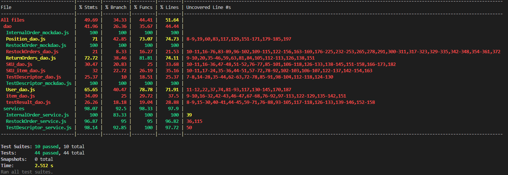

# Unit Testing Report

Date:

Version:

# Contents

- [Black Box Unit Tests](#black-box-unit-tests)

- [White Box Unit Tests](#white-box-unit-tests)

# Black Box Unit Tests

### **Class Restock Order Service - method *getAllIO***
**Criteria for method *getAllIO*:**
 - C1: Internal Orders
 - C2: connection to DB

**Predicates for method *getAllIO*:**
| Criteria | Predicate |
| :--------: | --------- |
| C1    | Returned Internal Orders are correct = T |
|       | Returned Internal Order are not correct = F |
| C2    | connection to DB works = T |
|       | connection to DB does not work = F |

**Combination of predicates**:
| Criteria 1 | Criteria 2 | Valid / Invalid | Description of the test case | Jest test case |
|:------: | :--------: | :-------: | :-------: | :-------: |
| T | T | Valid | *getAllIO* is correct | test('get all internal orders') in InternalOrder_service_mockDao.js |
| F | T | Invalid | *getAllIO* is not correct | test('get all internal orders') in InternalOrder_service_mockDao.js |
| T | F | Invalid | connection to DB failed | test('get all internal orders') in InternalOrder_service_mockDao.js |

### **Class Restock Order Service - method *getAllIOIssued***
**Criteria for method *getAllIOIssued*:**
 - C1: Internal Orders issued
 - C2: connection to DB

**Predicates for method *getAllIOIssued*:**
| Criteria | Predicate |
| :--------: | --------- |
| C1    | Returned Internal Orders issued are correct = T |
|       | Returned Internal Order issued are not correct = F |
| C2    | connection to DB works = T |
|       | connection to DB does not work = F |

**Combination of predicates**:
| Criteria 1 | Criteria 2 | Valid / Invalid | Description of the test case | Jest test case |
|:------: | :--------: | :-------: | :-------: | :-------: |
| T | T | Valid | *getAllIOIssued* is correct | test('get issued internal orders') in InternalOrder_service_mockDao.js |
| F | T | Invalid | *getAllIOIssued* is not correct | test('get issued internal orders') in InternalOrder_service_mockDao.js |
| T | F | Invalid | connection to DB failed | test('get issued internal orders') in InternalOrder_service_mockDao.js |

### **Class Restock Order Service - method *getAllIOAccepted***
**Criteria for method *getAllIOAccepted*:**
 - C1: Internal Orders issued
 - C2: connection to DB

**Predicates for method *getAllIOAccepted*:**
| Criteria | Predicate |
| :--------: | --------- |
| C1    | Returned Internal Orders accepted are correct = T |
|       | Returned Internal Order accepted are not correct = F |
| C2    | connection to DB works = T |
|       | connection to DB does not work = F |

**Combination of predicates**:
| Criteria 1 | Criteria 2 | Valid / Invalid | Description of the test case | Jest test case |
|:------: | :--------: | :-------: | :-------: | :-------: |
| T | T | Valid | *getAllIOIssued* is correct | test('get accepted internal orders') in InternalOrder_service_mockDao.js |
| F | T | Invalid | *getAllIOIssued* is not correct | test('get accepted internal orders') in InternalOrder_service_mockDao.js |
| T | F | Invalid | connection to DB failed | test('get accepted internal orders') in InternalOrder_service_mockDao.js |

### **Class Restock Order Service - method *getIO***
**Criteria for method *getIO*:**
 - C1: Internal Order by id
 - C2: connection to DB

**Predicates for method *getIO*:**
| Criteria | Predicate |
| :--------: | --------- |
| C1    | Returned Internal Order by id is correct = T |
|       | Returned Internal Order by id is not correct = F |
| C2    | connection to DB works = T |
|       | connection to DB does not work = F |

**Combination of predicates**:
| Criteria 1 | Criteria 2 | Valid / Invalid | Description of the test case | Jest test case |
|:------: | :--------: | :-------: | :-------: | :-------: |
| T | T | Valid | *getIO* is correct | test('getIO') in InternalOrder_service_mockDao.js |
| F | T | Invalid | *getIO* is not correct | test('getIO') in InternalOrder_service_mockDao.js |
| T | F | Invalid | connection to DB failed | test('getIO') in InternalOrder_service_mockDao.js |

### **Class Internal Order Service - method *addIO***
**Criteria for method *addIO*:**
 - C1: body 
 - C2: connection to DB

**Predicates for method *addIO*:**

| Criteria | Predicate |
| :--------: | --------- |
| C1    | Body contains correct attributes = T |
|       | Body does not contain correct attributes = F |
| C2    | connection to DB works = T |
|       | connection to DB does not work = F |

**Combination of predicates**:
| Criteria 1 | Criteria 2 | Valid / Invalid | Description of the test case | Jest test case |
| :--------: | :------: | :-------: | :-------: | :-------: |
| T | T | Valid | *addIO* is correct | test('insert IO') in InternalOrder_service_mockDao.js |
| F | T | Invalid | *addIO* is not correct | test('insert IO') in InternalOrder_service_mockDao.js |
| T | F | Invalid | connection to DB failed | test('insert IO') in InternalOrder_service_mockDao.js |

### **Class Internal Order Service - method *updateStateIO***
**Criteria for method *updateStateIO*:**
 - C1: Internal Order by id
 - C2: body
 - C3: connection to DB

**Predicates for method *updateStateIO*:**
| Criteria | Predicate |
| :--------: | --------- |
| C1    | Returned Internal Order by id is correct = T  |
|       | Returned Internal Order by id is not correct = F |
| C2    | Body contains correct attributes = T |
|       | Body does not contain correct attributes = F |
| C3    | connection to DB works = T |
|       | connection to DB does not work = F |

**Combination of predicates**:
| Criteria 1 | Criteria 2 | Criteria 3 | Valid / Invalid | Description of the test case | Jest test case |
| :----: | :---: | :-------: | :------: | :-------: | :-------: |
| T | T | T | Valid | *updateStateIO* is correct  | test('update IO') in InternalOrder_service_mockDao.js |
| F | T | T | Invalid | InternalOrder by id does not exist | InternalOrder_service_mockDao/updateIO |
| F | T | T | Invalid | Attributes are incorrect | test('update') in InternalOrder_service_mockDao.js |
| T | T | F | Invalid | connection to DB failed | test('update') in InternalOrder_service_mockDao.js |

### **Class Restock Order Service - method *getAllRO***
**Criteria for method *getAllRO*:**
 - C1: Restock Orders
 - C2: connection to DB

**Predicates for method *getAllRO*:**
| Criteria | Predicate |
| :--------: | --------- |
| C1    | Returned Restock Orders are correct = T |
|       | Returned Restock Order are not correct = F |
| C2    | connection to DB works = T |
|       | connection to DB does not work = F |

**Combination of predicates**:
| Criteria 1 | Criteria 2 | Valid / Invalid | Description of the test case | Jest test case |
| :------: | :--------: | :-------: | :-------: | :-------: |
| T | T | Valid | *getAllRO* is correct | test('get all restock orders') in RestockOrder_service_mockDao.js |
| F | T | Invalid | *getAllRO* is not correct | test('get all restock orders') in RestockOrder_service_mockDao.js |
| T | F | Invalid | connection to DB failed | test('get all restock orders') in RestockOrder_service_mockDao.js |

### **Class Restock Order Service - method *getAllROIssued***
**Criteria for method *getAllROIssued*:**
 - C1: Restock Orders issued
 - C2: connection to DB

**Predicates for method *getAllROIssued*:**
| Criteria | Predicate |
| :--------: | --------- |
| C1    | Returned Restock Orders issued are correct = T |
|       | Returned Restock Order issued are not correct = F |
| C2    | connection to DB works = T |
|       | connection to DB does not work = F |

**Combination of predicates**:
| Criteria 1 | Criteria 2 | Valid / Invalid | Description of the test case | Jest test case |
|:------: | :--------: | :-------: | :-------: | :-------: |
| T | T | Valid | *getAllROIssued* is correct | test('get issued restock orders') in RestockOrder_service_mockDao.js |
| F | T | Invalid | *getAllROIssued* is not correct | test('get issued restock orders') in RestockOrder_service_mockDao.js |
| T | F | Invalid | connection to DB failed | test('get issued restock orders') in RestockOrder_service_mockDao.js |

### **Class Restock Order Service - method *getRO***
**Criteria for method *getRO*:**
 - C1: Restock Order by id
 - C2: connection to DB

**Predicates for method *getRO*:**
| Criteria | Predicate |
| :--------: | --------- |
| C1    | Returned Restock Order by id is correct = T |
|       | Returned Restock Order by id is not correct = F |
| C2    | connection to DB works = T |
|       | connection to DB does not work = F |

**Combination of predicates**:
| Criteria 1 | Criteria 2 | Valid / Invalid | Description of the test case | Jest test case |
|:------: | :--------: | :-------: | :-------: | :-------: |
| T | T | Valid | *getRO* is correct | test('getRO') in RestockOrder_service_mockDao.js |
| F | T | Invalid | *getRO* is not correct | test('getRO') in RestockOrder_service_mockDao.js |
| T | F | Invalid | connection to DB failed | test('getRO') in RestockOrder_service_mockDao.js |

### **Class Restock Order Service - method *getROReturnedItems***
**Criteria for method *getROReturnedItems*:**
 - C1: Restock Order by id
 - C2: Restock Order state 
 - C3: connection to DB

**Predicates for method *getROReturnedItems*:**
| Criteria | Predicate |
| :--------: | --------- |
| C1    | Returned Restock Order by id is correct = T |
|       | Returned Restock Order by id is not correct = F |
| C2    | Returned Restock Order state correct = T |
|       | Returned Restock Order state is not correct = F |
| C3    | connection to DB works = T |
|       | connection to DB does not work = F |

**Combination of predicates**:
| Criteria 1 | Criteria 2 | Criteria 3 | Valid / Invalid | Description of the test case | Jest test case |
| :----: | :---: | :-------: | :------: | :-------: | :-------: |
| T | T | T | Valid | *getROReturnedItems* is correct  | test('get return items by roID') in RestockOrder_service_mockDao.js |
| F | T | T | Invalid | RestockOrder by id does not exist | test('get return items by roID') in RestockOrder_service_mockDao.js |
| T | F | T | Invalid | RestockOrder by id have incorrect state | test('get return items by roID') in RestockOrder_service_mockDao.js |
| T | T | F | Invalid | connection to DB failed | test('get return items by roID') in RestockOrder_service_mockDao.js |

### **Class Restock Order Service - method *addRO***
**Criteria for method *addRO*:**
 - C1: body 
 - C2: connection to DB

**Predicates for method *addRO*:**

| Criteria | Predicate |
| :--------: | --------- |
| C1    | Body contains correct attributes = T |
|       | Body does not contain correct attributes = F |
| C2    | connection to DB works = T |
|       | connection to DB does not work = F |

**Combination of predicates**:
| Criteria 1 | Criteria 2 | Valid / Invalid | Description of the test case | Jest test case |
| :--------: | :------: | :-------: | :-------: | :-------: |
| T | T | Valid | *addRO* is correct | test('insert RO') in RestockOrder_service_mockDao.js |
| F | T | Invalid | *addRO* is not correct | test('insert RO') in RestockOrder_service_mockDao.js |
| T | F | Invalid | *addRO* is not correct | test('insert RO') in RestockOrder_service_mockDao.js |

### **Class Restock Order Service - method *updateStateRO***
**Criteria for method *updateStateRO*:**
 - C1: Restock Order by id
 - C2: body
 - C3: connection to DB

**Predicates for method *updateStateRO*:**
| Criteria | Predicate |
| :--------: | --------- |
| C1    | Returned Restock Order by id is correct = T |
|       | Returned Restock Order by id is not correct = F |
| C2    | Body contains correct attributes = T |
|       | Body does not contain correct attributes = F |
| C3    | connection to DB works = T |
|       | connection to DB does not work = F |

**Combination of predicates**:
| Criteria 1 | Criteria 2 | Criteria 3 | Valid / Invalid | Description of the test case | Jest test case |
| :----: | :-----: | :-----: | :-------: | :-------: | :-------: |
| T | T | T | Valid | *updateStateRO* is correct | test('update RO state') in RestockOrder_service_mockDao.js |
| F | T | T | Invalid | RestockOrder by id does not exist | test('update RO state') in RestockOrder_service_mockDao.js |
| T | F | T | Invalid | Attributes are incorrect | test('update RO state') in RestockOrder_service_mockDao.js |
| T | T | F | Invalid | Connection to DB failed | test('update RO state') in RestockOrder_service_mockDao.js |

### **Class Restock Order Service - method *addSkuItems***
**Criteria for method *addSkuItems*:**
 - C1: Restock Order by id
 - C2: Restock Order state 
 - C3: body
 - C4: connection to DB

**Predicates for method *addSkuItems*:**
| Criteria | Predicate |
| :--------: | :--------- |
| C1    | Returned Restock Order by id is correct = T |
|       | Returned Restock Order by id is not correct = F |
| C2    | Returned Restock Order state correct = T |
|       | Returned Restock Order state is not correct = F |
| C3    | Body contains correct attributes = T |
|       | Body does not contain correct attributes = F |
| C4    | connection to DB works = T |
|       | connection to DB does not work = F |

**Combination of predicates**:
| Criteria 1 | Criteria 2 | Criteria 3 | Criteria 4 | Valid / Invalid | Description of the test case | Jest test case |
| :------: | :---: | :-----: | :---: | :-------: | :-------: | :-------: |
| T | T | T | T | Valid | *addSkuItems* is correct | test('update RO skuItems') in RestockOrder_service_mockDao.js |
| F | T | T | T | Invalid | RestockOrder by id does not exist | test('update RO skuItems') in RestockOrder_service_mockDao.js |
| T | F | T | T | Invalid | RestockOrder state is not correct | test('update RO skuItems') in RestockOrder_service_mockDao.js |
| T | T | F | T | Invalid | Attributes are incorrect | test('update RO skuItems') in RestockOrder_service_mockDao.js |
| T | T | T | F | Invalid | Connection to DB failed | test('update RO skuItems') in RestockOrder_service_mockDao.js |

### **Class Restock Order Service - method *addTransportNote***
**Criteria for method *addTransportNote*:**
 - C1: Restock Order by id
 - C2: Restock Order state 
 - C3: body
 - C4: connection to DB

**Predicates for method *addTransportNote*:**
| Criteria   | Predicate |
| :--------: | --------- |
| C1    | Returned Restock Order by id is correct = T |
|       | Returned Restock Order by id is not correct = F |
| C2    | Returned Restock Order state correct = T |
|       | Returned Restock Order state is not correct = F |
| C3    | Body contains correct attributes = T |
|       | Body does not contain correct attributes = F |
| C4    | connection to DB works = T |
|       | connection to DB does not work = F |

**Combination of predicates**:
| Criteria 1 | Criteria 2 | Criteria 3 | Criteria 4 | Valid / Invalid | Description of the test case | Jest test case |
| :------: | :---: | :-----: | :---: | :-------: | :-------: | :-------: |
| T | T | T | T | Valid | *addSkuItems* is correct | test('update RO skuItems') in RestockOrder_service_mockDao.js |
| F | T | T | T | Invalid | RestockOrder by id does not exist | test('update RO transportNote') in RestockOrder_service_mockDao.js |
| T | F | T | T | Invalid | RestockOrder state is not correct | test('update RO transportNote') in RestockOrder_service_mockDao.js |
| T | T | F | T | Invalid | Attributes are incorrect | test('update RO transportNote') in RestockOrder_service_mockDao.js |
| T | T | T | F | Invalid | Connection to DB failed | test('update RO transportNote') in RestockOrder_service_mockDao.js |

### **Class Test Descriptor Service - method *getAllTD***
**Criteria for method *getAllTD*:**
 - C1: Test descriptors
 - C2: connection to DB

**Predicates for method *getAllTD*:**
| Criteria | Predicate |
| :--------: | --------- |
| C1    | Returned Test descriptors are correct = T |
|       | Returned Test descriptors are not correct = F |
| C2    | connection to DB works = T |
|       | connection to DB does not work = F |

**Combination of predicates**:
| Criteria 1 | Criteria 2 | Valid / Invalid | Description of the test case | Jest test case |
|:------: | :--------: | :-------: | :-------: | :-------: |
| T | T | Valid | *getAllTD* is correct | test('get all test descriptors') in TestDescriptor_service_mockDao.js |
| F | T | Invalid | *getAllTD* is not correct | test('get all test descriptors') in TestDescriptor_service_mockDao.js |
| T | F | Invalid | connection to DB failed | test('get all test descriptors') in TestDescriptor_service_mockDao.js |

### **Class Test Descriptor Service - method *getTD***
**Criteria for method *getTD*:**
 - C1: Test descriptors by id
 - C2: connection to DB

**Predicates for method *getTD*:**
| Criteria | Predicate |
| :--------: | --------- |
| C1    | Returned Test descriptor by id is correct = T |
|       | Returned Test descriptor by id is not correct = F |
| C2    | connection to DB works = T |
|       | connection to DB does not work = F |

**Combination of predicates**:
| Criteria 1 | Criteria 2 | Valid / Invalid | Description of the test case | Jest test case |
|:------: | :--------: | :-------: | :-------: | :-------: |
| T | T | Valid | *getTD* is correct | test('get test descriptor') in TestDescriptor_service_mockDao.js |
| F | T | Invalid | *getTD* is not correct | test('get test descriptor') in TestDescriptor_service_mockDao.js |
| T | F | Invalid | connection to DB failed | test('get test descriptor') in TestDescriptor_service_mockDao.js |

### **Class Test Descriptor Service - method *addTD***
**Criteria for method *addTD*:**
 - C1: SKU by id
 - C2: connection to DB

**Predicates for method *addTD*:**
| Criteria | Predicate |
| :--------: | --------- |
| C1    | SKU by id is correct = T  |
|       | SKU by id is not correct = F |
| C2    | connection to DB works = T |
|       | connection to DB does not work = F |

**Combination of predicates**:
| Criteria 1 | Criteria 2 | Valid / Invalid | Description of the test case | Jest test case |
|:------: | :--------: | :-------: | :-------: | :-------: |
| T | T | Valid | *addTD* is correct | test('add TD') in TestDescriptor_service_mockDao.js |
| F | T | Invalid | *addTD* is not correct | test('add TD') in TestDescriptor_service_mockDao.js |
| T | F | Invalid | connection to DB failed | test('add TD') in TestDescriptor_service_mockDao.js |

### **Class Test Descriptor Service - method *modifyTD***
**Criteria for method *modifyTD*:**
 - C1: Test descriptors by id
 - C2: SKU by id
 - C3: connection to DB

**Predicates for method *modifyTD*:**
| Criteria | Predicate |
| :--------: | --------- |
| C1    | Returned Test descriptor by id is correct = T |
|       | Returned Test descriptor by id is not correct = F |
| C2    | SKU by id is correct = T  |
|       | SKU by id is not correct = F |
| C3    | connection to DB works = T |
|       | connection to DB does not work = F |

**Combination of predicates**:
| Criteria 1 | Criteria 2 | Criteria 3 | Valid / Invalid | Description of the test case | Jest test case |
| :-----: | :----: | :-----: | :-------: | :-------: | :-------: |
| T | T | T | Valid | *modifyTD* is correct | test('modify TD') in TestDescriptor_service_mockDao.js |
| F | T | T | Valid | Test descriptor by id is not correct | test('modify TD') in TestDescriptor_service_mockDao.js |
| T | F | T | Valid | SKU by id is not correct | test('modify TD') in TestDescriptor_service_mockDao.js |
| T | T | F | Valid | Connection to DB failed | test('modify TD') in TestDescriptor_service_mockDao.js |

### **Class Test Descriptor Service - method *deleteTD***
**Criteria for method *deleteTD*:**
 - C1: Test descriptors by id
 - C2: SKU by id
 - C3: connection to DB

**Predicates for method *deleteTD*:**
| Criteria | Predicate |
| :--------: | --------- |
| C1    | Returned Test descriptor by id is correct = T |
|       | Returned Test descriptor by id is not correct = F |
| C2    | SKU by id is correct = T  |
|       | SKU by id is not correct = F |
| C3    | connection to DB works = T |
|       | connection to DB does not work = F |

**Combination of predicates**:
| Criteria 1 | Criteria 2 | Criteria 3 | Valid / Invalid | Description of the test case | Jest test case |
| :-----: | :----: | :-----: | :-------: | :-------: | :-------: |
| T | T | T | Valid | *deleteTD* is correct | test('delete TD') in TestDescriptor_service_mockDao.js |
| F | T | T | Valid | Test descriptor by id is not correct | test('delete TD') in TestDescriptor_service_mockDao.js |
| T | F | T | Valid | SKU by id is not correct | test('delete TD') in TestDescriptor_service_mockDao.js |
| T | T | F | Valid | Connection to DB failed | test('delete TD') in TestDescriptor_service_mockDao.js |

### **Class Return Order Dao - method *getAllReturnOrders***
**Criteria for method *getAllReturnOrders*:**
 - C1: Return Orders
 - C2: connection to DB

**Predicates for method *getAllReturnOrders*:**

| Criteria | Predicate |
| :--------: | --------- |
| C1    | Returned Orders are correct = T |
|       | Returned Order are not correct = F |
| C2    | connection to DB works = T |
|       | connection to DB does not work = F |

**Combination of predicates**:
| Criteria 1 | Criteria 2 | Valid / Invalid | Description of the test case | Jest test case |
|:------: | :--------: | :-------: | :-------: | :-------: |
| T | T | Valid | *getAllReturnOrders* is correct | test('get all returned orders') in ReturnOrder.test.js |
| F | T | Invalid | *getAllReturnOrders* is not correct | test('get all Return Order') in ReturnOrder.test.js |
| T | F | Invalid | connection to DB failed | test('get all ReturnOrder') in ReturnOrder.test.js |

### **Class Return Order Dao - method *getReturnOrderById***
**Criteria for method *getReturnOrderById*:**
 - C1: Internal Order by id
 - C2: connection to DB

**Predicates for method *getIO*:**
| Criteria | Predicate |
| :--------: | --------- |
| C1    | Returned Order by id is correct = T |
|       | Returned Order by id is not correct = F |
| C2    | connection to DB works = T |
|       | connection to DB does not work = F |

**Combination of predicates**:
| Criteria 1 | Criteria 2 | Valid / Invalid | Description of the test case | Jest test case |
|:------: | :--------: | :-------: | :-------: | :-------: |
| T | T | Valid | *getReturnOrderById* is correct | test('getReturnOrderById') in ReturnOrder.test.js |
| F | T | Invalid | *getReturnOrderById* is not correct | test('getReturnOrderById') in ReturnOrder.test.js |
| T | F | Invalid | connection to DB failed | test('getReturnOrderById') in ReturnOrder.test.js |

### **Class Return Order Dao - method *createNewReturnOrder***
**Criteria for method *createNewReturnOrder*:**
 - C1: body 
 - C2: connection to DB

**Predicates for method *createNewReturnOrder*:**

| Criteria | Predicate |
| :--------: | --------- |
| C1    | Body contains correct attributes = T |
|       | Body does not contain correct attributes = F |
| C2    | connection to DB works = T |
|       | connection to DB does not work = F |

**Combination of predicates**:
| Criteria 1 | Criteria 2 | Valid / Invalid | Description of the test case | Jest test case |
| :--------: | :------: | :-------: | :-------: | :-------: |
| T | T | Valid | *createNewReturnOrder* is correct | test('createNewReturnOrder') in ReturnOrder.test.js |
| F | T | Invalid | *createNewReturnOrder* is not correct | test('createNewReturnOrder') in ReturnOrder.test.js |
| T | F | Invalid | connection to DB failed | test('createNewReturnOrder') in ReturnOrder.test.js |

### **Class Return Order Dao - method *deleteReturnOrderById***
**Criteria for method *deleteReturnOrderById*:**

 - C1: Return Order by id
 - C2: body
 - C3: connection to DB

**Predicates for method *deleteReturnOrderById*:**
| Criteria | Predicate |
| :--------: | --------- |
| C1    | Returned Order by id is correct = T  |
|       | Returned  Order by id is not correct = F |
| C2    | Body contains correct attributes = T |
|       | Body does not contain correct attributes = F |
| C3    | connection to DB works = T |
|       | connection to DB does not work = F |

**Combination of predicates**:
| Criteria 1 | Criteria 2 | Criteria 3 | Valid / Invalid | Description of the test case | Jest test case |
| :----: | :---: | :-------: | :------: | :-------: | :-------: |
| T | T | T | Valid | *deleteReturnOrderById* is correct  | test('deleteReturnOrderById') in ReturnOrder.test.js |
| F | T | T | Invalid | ReturnOrder by id does not exist | ReturnOrder_service_mockDao/updateIO |
| F | T | T | Invalid | Attributes are incorrect | test('deleteReturnOrderById') in ReturnOrder.test.js |
| T | T | F | Invalid | connection to DB failed | test('deleteReturnOrderById') in ReturnOrder.test.js |

### **Class UserDao - method *getAllSuppliers***

**Criteria for method *getAllSuppliers*:**

 - C1: Return suppliers

**Predicates for method *getAllSuppliers*:**

| Criteria | Predicate                     |
| :------: | ----------------------------- |
|    C1    | Suppliers are correct = T     |
|          | Suppliers are not correct = F |

**Combination of predicates**:

| Criteria 1 | Valid / Invalid |   Description of the test case   |              Jest test case               |
| :--------: | :-------------: | :------------------------------: | :---------------------------------------: |
|     T      |      Valid      |   *getAllSuppliers* is correct   | test(' getsuppliers') in User_dao.test.js |
|     F      |     Invalid     | *getAllSuppliers* is not correct | test(' getsuppliers') in User_dao.test.js |

### **Class UserDao - method **updateUserByUsername****

**Criteria for method *updateUserByUsername*:**

 - C1: validity of username
 - C2: validity of newType
 - C3: validity of oldType

**Predicates for method *updateUserByUsername*:**

| Criteria | Predicate                  |
| :------: | -------------------------- |
|    C1    | Username is correct = T    |
|          | Username is false = F      |
|    C2    | newType is valid = T       |
|          | newType is not valid  =  F |
|    C3    | oldType is valid =  T      |
|          | oldType is not valid = F   |

**Combination of predicates**:

| Criteria 1 | Criteria 2 | Criteria 3 | Valid / Invalid |     Description of the test case      |             Jest test case              |
| :--------: | ---------- | ---------- | :-------------: | :-----------------------------------: | :-------------------------------------: |
|     T      | T          | T          |      Valid      |   *updateUserByUsername* is correct   | test(' UpdateUser') in User_dao.test.js |
|     *      | *          | F          |     Invalid     | *updateUserByUsername* is not correct | test(' UpdateUser') in User_dao.test.js |
|     *      | F          | *          |     Invalid     | *updateUserByUsername* is not correct | test(' UpdateUser') in User_dao.test.js |
|     F      | *          | *          |     Invalid     | *updateUserByUsername* is not correct | test(' UpdateUser') in User_dao.test.js |

### **Class UserDao - method deleteUserByUsernameAndType**

**Criteria for method *deleteUserByUsernameAndType*:**

 - C1: validity of username
 - C2: validity of type

**Predicates for method *deleteUserByUsernameAndType*:**

| Criteria | Predicate               |
| :------: | ----------------------- |
|    C1    | Username is correct = T |
|          | Username is false = F   |
|    C2    | Type is valid = T       |
|          | Type is not valid  = F  |

**Combination of predicates**:

| Criteria 1 | Criteria 2 | Valid / Invalid |         Description of the test case         |             Jest test case              |
| :--------: | ---------- | :-------------: | :------------------------------------------: | :-------------------------------------: |
|     T      | T          |      Valid      |   *deleteUserByUsernameAndType* is correct   | test(' deleteuser') in User_dao.test.js |
|     *      | F          |     Invalid     | *deleteUserByUsernameAndType* is not correct | test(' deleteuser') in User_dao.test.js |
|     F      | *          |     Invalid     | *deleteUserByUsernameAndType* is not correct | test(' deleteuser') in User_dao.test.js |

### **Class PositionDao - method *validatePositionID***

**Criteria for method *validatePositionID*:**

 - C1: values of positionId, aisleId, row, col

**Predicates for method *validatePositionID*:**

| Criteria | Predicate                                           |
| :------: | --------------------------------------------------- |
|    C1    | values of positionId, aisleId, row, col are correct |

**Combination of predicates**:

| Criteria 1 | Valid / Invalid |  Description of the test case   |                     Jest test case                      |
| :--------: | :-------------: | :-----------------------------: | :-----------------------------------------------------: |
|     T      |      Valid      | *validatePositionID* is correct | test(' tes validatePositionID') in Position_dao.test.js |

### **Class PositionDao - method *getAllPositions***

**Criteria for method *getAllPositions*:**

 - C1: Return suppliers

**Predicates for method *getAllPositions*:**

| Criteria | Predicate                     |
| :------: | ----------------------------- |
|    C1    | Positions are correct = T     |
|          | Positions are not correct = F |

**Combination of predicates**:

| Criteria 1 | Valid / Invalid |   Description of the test case   |                Jest test case                |
| :--------: | :-------------: | :------------------------------: | :------------------------------------------: |
|     T      |      Valid      |   *getAllPositions* is correct   | test(' getPosition') in position_dao.test.js |
|     F      |     Invalid     | *getAllPositions* is not correct | test(' getPosition') in position_dao.test.js |

### **Class PositionDao - method createNewPosition**

**Criteria for method *createNewPosition*:**

 - C1: validity of parameters

**Predicates for method *createNewPosition*:**

| Criteria | Predicate                             |
| :------: | ------------------------------------- |
|    C1    | validity of parameters is correct = T |
|          | validity of parameters is false = F   |

**Combination of predicates**:

| Criteria 1 | Valid / Invalid |    Description of the test case    |                 Jest test case                  |
| :--------: | :-------------: | :--------------------------------: | :---------------------------------------------: |
|     T      |      Valid      |   *createNewPosition* is correct   | test(' createPosition') in Position_dao.test.js |
|     *      |     Invalid     | *createNewPosition* is not correct | test(' createPosition') in Position_dao.test.js |

### **Class PositionDao - method createNewPosition**

**Criteria for method *updatePositionByPosId*:**

 - C1: validity of parameters

**Predicates for method *updatePositionByPosId*:**

| Criteria | Predicate                             |
| :------: | ------------------------------------- |
|    C1    | validity of parameters is correct = T |
|          | validity of parameters is false = F   |

**Combination of predicates**:

| Criteria 1 | Valid / Invalid |      Description of the test case      |                     Jest test case                     |
| :--------: | :-------------: | :------------------------------------: | :----------------------------------------------------: |
|     T      |      Valid      |   *updatePositionByPosId* is correct   | test(' updatePositionByPosId') in Position_dao.test.js |
|     *      |     Invalid     | *updatePositionByPosId* is not correct | test(' updatePositionByPosId') in Position_dao.test.js |

---
---
---
# White Box Unit Tests

### Test cases definition

| Unit name | Jest test case |
| :--- | :--- |
| TestDescriptor_service | TestDescriptor_service_mockdao |
| RestockOrder_service | RestockOrder_service_mockdao |
| InternalOrder_service | InternalOrder_service_mockdao |

### Code coverage report

